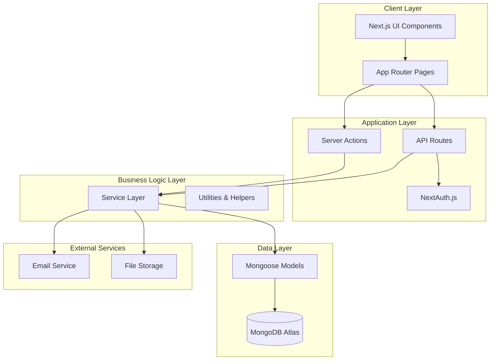

# ERP System Design Document

## Overview

This document outlines the technical design for a comprehensive Enterprise Resource Planning (ERP) system built with Next.js 14+ (App Router), shadcn/ui components, and MongoDB Atlas. The system follows a modular architecture with server-side rendering, API routes, and a modern component-based UI.

### Technology Stack

- **Frontend**: Next.js 14+ (App Router), React 18+, TypeScript
- **UI Components**: shadcn/ui (Radix UI primitives), Tailwind CSS
- **Backend**: Next.js API Routes, Server Actions
- **Database**: MongoDB Atlas with Mongoose ODM
- **Authentication**: NextAuth.js v5 (Auth.js)
- **State Management**: React Context + Zustand for complex state
- **Forms**: React Hook Form + Zod validation
- **Charts**: Recharts
- **Tables**: TanStack Table (React Table v8)
- **File Upload**: uploadthing or custom S3 integration
- **Email**: Resend or NodeMailer
- **PDF Generation**: react-pdf or jsPDF

## Architecture

### High-Level Architecture



### Directory Structure

```
/
├── app/
│   ├── (auth)/
│   │   ├── login/
│   │   └── register/
│   ├── (dashboard)/
│   │   ├── layout.tsx
│   │   ├── page.tsx (main dashboard)
│   │   ├── inventory/
│   │   ├── crm/
│   │   ├── sales/
│   │   ├── purchases/
│   │   ├── finance/
│   │   ├── hr/
│   │   ├── projects/
│   │   ├── documents/
│   │   ├── reports/
│   │   └── settings/
│   ├── api/
│   │   ├── auth/
│   │   ├── inventory/
│   │   ├── customers/
│   │   ├── orders/
│   │   └── [...other modules]/
│   └── layout.tsx
├── components/
│   ├── ui/ (shadcn components)
│   ├── dashboard/
│   ├── inventory/
│   ├── crm/
│   ├── forms/
│   ├── tables/
│   ├── charts/
│   └── shared/
├── lib/
│   ├── db/
│   │   ├── mongodb.ts
│   │   └── models/
│   ├── services/
│   ├── utils/
│   ├── validations/
│   └── hooks/
├── types/
├── public/
└── config/
```

## Components and Interfaces

### 1. Authentication System

**NextAuth.js Configuration**

```typescript
// lib/auth.ts
interface User {
  id: string;
  email: string;
  name: string;
  role: 'admin' | 'manager' | 'employee' | 'user';
  organizationId: string;
  avatar?: string;
}

interface Session {
  user: User;
  expires: string;
}
```

**Features:**
- Credentials provider with bcrypt password hashing
- JWT-based sessions
- Role-based access control middleware
- Organization-based data isolation

### 2. Dashboard Module

**Components:**
- `DashboardLayout`: Main layout with sidebar navigation
- `StatsCard`: KPI display cards
- `RevenueChart`: Line/area chart for revenue trends
- `SalesOverview`: Bar chart for sales data
- `RecentActivity`: List of recent transactions
- `QuickActions`: Shortcut buttons for common tasks

**Data Aggregation:**
- Real-time metrics using MongoDB aggregation pipelines
- Cached dashboard data with 5-minute TTL
- WebSocket or polling for live updates

### 3. Inventory Management Module

**Data Models:**

```typescript
interface Product {
  _id: ObjectId;
  organizationId: ObjectId;
  sku: string;
  name: string;
  description: string;
  category: string;
  unit: string;
  costPrice: number;
  sellingPrice: number;
  reorderLevel: number;
  barcode?: string;
  images: string[];
  isActive: boolean;
  createdAt: Date;
  updatedAt: Date;
}

interface InventoryTransaction {
  _id: ObjectId;
  organizationId: ObjectId;
  productId: ObjectId;
  warehouseId: ObjectId;
  type: 'in' | 'out' | 'adjustment';
  quantity: number;
  referenceType: 'purchase' | 'sale' | 'transfer' | 'adjustment';
  referenceId?: ObjectId;
  userId: ObjectId;
  notes?: string;
  createdAt: Date;
}

interface Warehouse {
  _id: ObjectId;
  organizationId: ObjectId;
  name: string;
  location: string;
  isActive: boolean;
}

interface StockLevel {
  _id: ObjectId;
  organizationId: ObjectId;
  productId: ObjectId;
  warehouseId: ObjectId;
  quantity: number;
  updatedAt: Date;
}
```

**Components:**
- `ProductList`: Data table with filtering and sorting
- `ProductForm`: Create/edit product form
- `StockLevelIndicator`: Visual stock status
- `InventoryTransactionLog`: Transaction history
- `BarcodeScanner`: Barcode scanning interface
- `LowStockAlerts`: Alert notifications

### 4. CRM Module

**Data Models:**

```typescript
interface Customer {
  _id: ObjectId;
  organizationId: ObjectId;
  type: 'individual' | 'company';
  name: string;
  email: string;
  phone: string;
  company?: string;
  address: Address;
  taxId?: string;
  paymentTerms: number;
  creditLimit?: number;
  tags: string[];
  isActive: boolean;
  createdAt: Date;
  updatedAt: Date;
}

interface Opportunity {
  _id: ObjectId;
  organizationId: ObjectId;
  customerId: ObjectId;
  title: string;
  description: string;
  value: number;
  stage: 'lead' | 'qualified' | 'proposal' | 'negotiation' | 'closed-won' | 'closed-lost';
  probability: number;
  expectedCloseDate: Date;
  assignedTo: ObjectId;
  createdAt: Date;
  updatedAt: Date;
}

interface Interaction {
  _id: ObjectId;
  organizationId: ObjectId;
  customerId: ObjectId;
  type: 'call' | 'email' | 'meeting' | 'note';
  subject: string;
  notes: string;
  userId: ObjectId;
  createdAt: Date;
}
```

**Components:**
- `CustomerList`: Searchable customer table
- `CustomerProfile`: Detailed customer view
- `OpportunityPipeline`: Kanban board for opportunities
- `InteractionTimeline`: Chronological interaction history
- `CustomerForm`: Customer creation/editing

### 5. Sales Order Module

**Data Models:**

```typescript
interface SalesOrder {
  _id: ObjectId;
  organizationId: ObjectId;
  orderNumber: string;
  customerId: ObjectId;
  orderDate: Date;
  status: 'draft' | 'confirmed' | 'shipped' | 'delivered' | 'completed' | 'cancelled';
  items: OrderItem[];
  subtotal: number;
  taxAmount: number;
  discountAmount: number;
  shippingAmount: number;
  total: number;
  paymentStatus: 'pending' | 'partial' | 'paid';
  shippingAddress: Address;
  notes?: string;
  createdBy: ObjectId;
  createdAt: Date;
  updatedAt: Date;
}

interface OrderItem {
  productId: ObjectId;
  quantity: number;
  unitPrice: number;
  discount: number;
  taxRate: number;
  total: number;
}

interface Invoice {
  _id: ObjectId;
  organizationId: ObjectId;
  invoiceNumber: string;
  orderId: ObjectId;
  customerId: ObjectId;
  invoiceDate: Date;
  dueDate: Date;
  items: OrderItem[];
  subtotal: number;
  taxAmount: number;
  total: number;
  paidAmount: number;
  status: 'draft' | 'sent' | 'paid' | 'overdue' | 'cancelled';
  createdAt: Date;
}
```

**Components:**
- `OrderList`: Filterable order table
- `OrderForm`: Multi-step order creation
- `OrderDetails`: Order view with status tracking
- `InvoiceGenerator`: Invoice creation and PDF export
- `PaymentRecorder`: Payment entry form

### 6. Purchase Order Module

**Data Models:**

```typescript
interface Supplier {
  _id: ObjectId;
  organizationId: ObjectId;
  name: string;
  email: string;
  phone: string;
  address: Address;
  paymentTerms: number;
  taxId?: string;
  isActive: boolean;
  createdAt: Date;
}

interface PurchaseOrder {
  _id: ObjectId;
  organizationId: ObjectId;
  poNumber: string;
  supplierId: ObjectId;
  orderDate: Date;
  expectedDeliveryDate: Date;
  status: 'draft' | 'sent' | 'partial' | 'received' | 'completed' | 'cancelled';
  items: OrderItem[];
  subtotal: number;
  taxAmount: number;
  total: number;
  receivedItems: ReceivedItem[];
  notes?: string;
  createdBy: ObjectId;
  createdAt: Date;
  updatedAt: Date;
}

interface ReceivedItem {
  productId: ObjectId;
  quantityReceived: number;
  receivedDate: Date;
  receivedBy: ObjectId;
}
```

**Components:**
- `SupplierList`: Supplier management table
- `PurchaseOrderForm`: PO creation form
- `PurchaseOrderList`: PO tracking table
- `ReceivingInterface`: Goods receiving form
- `SupplierPerformance`: Supplier analytics

### 7. Financial Management Module

**Data Models:**

```typescript
interface Account {
  _id: ObjectId;
  organizationId: ObjectId;
  code: string;
  name: string;
  type: 'asset' | 'liability' | 'equity' | 'revenue' | 'expense';
  category: string;
  parentAccountId?: ObjectId;
  isActive: boolean;
}

interface Transaction {
  _id: ObjectId;
  organizationId: ObjectId;
  transactionNumber: string;
  date: Date;
  type: 'journal' | 'payment' | 'receipt' | 'invoice' | 'bill';
  description: string;
  entries: JournalEntry[];
  referenceType?: string;
  referenceId?: ObjectId;
  createdBy: ObjectId;
  createdAt: Date;
}

interface JournalEntry {
  accountId: ObjectId;
  debit: number;
  credit: number;
  description?: string;
}

interface Payment {
  _id: ObjectId;
  organizationId: ObjectId;
  paymentNumber: string;
  date: Date;
  type: 'received' | 'made';
  customerId?: ObjectId;
  supplierId?: ObjectId;
  amount: number;
  paymentMethod: 'cash' | 'check' | 'bank-transfer' | 'card';
  reference?: string;
  accountId: ObjectId;
  createdAt: Date;
}
```

**Components:**
- `ChartOfAccounts`: Hierarchical account tree
- `TransactionList`: Transaction journal
- `TransactionForm`: Journal entry form
- `ProfitLossReport`: P&L statement generator
- `BalanceSheet`: Balance sheet generator
- `CashFlowStatement`: Cash flow report
- `AccountsReceivable`: AR aging report
- `AccountsPayable`: AP aging report

### 8. HR Management Module

**Data Models:**

```typescript
interface Employee {
  _id: ObjectId;
  organizationId: ObjectId;
  employeeId: string;
  userId?: ObjectId;
  firstName: string;
  lastName: string;
  email: string;
  phone: string;
  dateOfBirth: Date;
  hireDate: Date;
  department: string;
  jobTitle: string;
  salary: number;
  employmentType: 'full-time' | 'part-time' | 'contract';
  status: 'active' | 'inactive' | 'terminated';
  address: Address;
  emergencyContact: EmergencyContact;
  documents: string[];
  createdAt: Date;
}

interface Attendance {
  _id: ObjectId;
  organizationId: ObjectId;
  employeeId: ObjectId;
  date: Date;
  clockIn: Date;
  clockOut?: Date;
  hoursWorked?: number;
  status: 'present' | 'absent' | 'late' | 'half-day';
}

interface Leave {
  _id: ObjectId;
  organizationId: ObjectId;
  employeeId: ObjectId;
  leaveType: 'vacation' | 'sick' | 'personal' | 'unpaid';
  startDate: Date;
  endDate: Date;
  days: number;
  reason: string;
  status: 'pending' | 'approved' | 'rejected';
  approvedBy?: ObjectId;
  createdAt: Date;
}

interface LeaveBalance {
  _id: ObjectId;
  organizationId: ObjectId;
  employeeId: ObjectId;
  year: number;
  leaveType: string;
  allocated: number;
  used: number;
  balance: number;
}
```

**Components:**
- `EmployeeList`: Employee directory
- `EmployeeProfile`: Detailed employee view
- `AttendanceTracker`: Clock in/out interface
- `AttendanceReport`: Attendance summary
- `LeaveRequestForm`: Leave application
- `LeaveApproval`: Manager approval interface
- `PayrollReport`: Payroll calculation view

### 9. Project Management Module

**Data Models:**

```typescript
interface Project {
  _id: ObjectId;
  organizationId: ObjectId;
  name: string;
  description: string;
  customerId?: ObjectId;
  startDate: Date;
  endDate: Date;
  status: 'planning' | 'active' | 'on-hold' | 'completed' | 'cancelled';
  budget: number;
  actualCost: number;
  projectManager: ObjectId;
  teamMembers: ObjectId[];
  tags: string[];
  createdAt: Date;
  updatedAt: Date;
}

interface Task {
  _id: ObjectId;
  organizationId: ObjectId;
  projectId: ObjectId;
  title: string;
  description: string;
  assignedTo?: ObjectId;
  status: 'todo' | 'in-progress' | 'review' | 'completed';
  priority: 'low' | 'medium' | 'high' | 'urgent';
  dueDate?: Date;
  estimatedHours?: number;
  actualHours?: number;
  dependencies: ObjectId[];
  createdBy: ObjectId;
  createdAt: Date;
  updatedAt: Date;
}

interface TimeEntry {
  _id: ObjectId;
  organizationId: ObjectId;
  projectId: ObjectId;
  taskId?: ObjectId;
  employeeId: ObjectId;
  date: Date;
  hours: number;
  description: string;
  billable: boolean;
  createdAt: Date;
}
```

**Components:**
- `ProjectList`: Project overview table
- `ProjectBoard`: Kanban board for tasks
- `GanttChart`: Timeline visualization
- `TaskForm`: Task creation/editing
- `TimeTracker`: Time entry interface
- `ProjectDashboard`: Project metrics

### 10. Document Management Module

**Data Models:**

```typescript
interface Document {
  _id: ObjectId;
  organizationId: ObjectId;
  name: string;
  fileUrl: string;
  fileSize: number;
  mimeType: string;
  folderId?: ObjectId;
  entityType?: string;
  entityId?: ObjectId;
  tags: string[];
  uploadedBy: ObjectId;
  createdAt: Date;
  updatedAt: Date;
}

interface Folder {
  _id: ObjectId;
  organizationId: ObjectId;
  name: string;
  parentFolderId?: ObjectId;
  createdBy: ObjectId;
  createdAt: Date;
}
```

**Components:**
- `DocumentExplorer`: File browser interface
- `FileUploader`: Drag-and-drop upload
- `DocumentViewer`: Preview documents
- `FolderTree`: Hierarchical folder navigation

### 11. Notification System

**Data Models:**

```typescript
interface Notification {
  _id: ObjectId;
  organizationId: ObjectId;
  userId: ObjectId;
  type: 'info' | 'warning' | 'error' | 'success';
  title: string;
  message: string;
  entityType?: string;
  entityId?: ObjectId;
  isRead: boolean;
  createdAt: Date;
}

interface NotificationPreference {
  _id: ObjectId;
  userId: ObjectId;
  eventType: string;
  inApp: boolean;
  email: boolean;
}
```

**Components:**
- `NotificationCenter`: Dropdown notification list
- `NotificationBadge`: Unread count indicator
- `NotificationSettings`: Preference configuration

### 12. Reporting Module

**Report Types:**
- Sales reports (by period, product, customer)
- Inventory reports (stock levels, movements, valuation)
- Financial reports (P&L, balance sheet, cash flow)
- HR reports (attendance, leave, payroll)
- Project reports (progress, time tracking, budget)
- Custom reports with filters

**Components:**
- `ReportBuilder`: Custom report configuration
- `ReportViewer`: Report display with charts
- `ExportButton`: PDF/Excel export
- `ScheduledReports`: Automated report scheduling

## Data Models

### Common Interfaces

```typescript
interface Address {
  street: string;
  city: string;
  state: string;
  postalCode: string;
  country: string;
}

interface EmergencyContact {
  name: string;
  relationship: string;
  phone: string;
}

interface AuditLog {
  _id: ObjectId;
  organizationId: ObjectId;
  userId: ObjectId;
  action: 'create' | 'update' | 'delete';
  entityType: string;
  entityId: ObjectId;
  changes: Record<string, any>;
  ipAddress: string;
  userAgent: string;
  createdAt: Date;
}

interface Organization {
  _id: ObjectId;
  name: string;
  email: string;
  phone: string;
  address: Address;
  logo?: string;
  currency: string;
  timezone: string;
  taxId?: string;
  settings: OrganizationSettings;
  createdAt: Date;
}

interface OrganizationSettings {
  branding: {
    primaryColor: string;
    secondaryColor: string;
  };
  features: {
    inventory: boolean;
    crm: boolean;
    projects: boolean;
    hr: boolean;
  };
  notifications: {
    lowStockThreshold: number;
    invoiceDueDays: number;
  };
}
```

## Error Handling

### Error Types

```typescript
class AppError extends Error {
  statusCode: number;
  isOperational: boolean;
  
  constructor(message: string, statusCode: number) {
    super(message);
    this.statusCode = statusCode;
    this.isOperational = true;
  }
}

class ValidationError extends AppError {
  constructor(message: string) {
    super(message, 400);
  }
}

class AuthenticationError extends AppError {
  constructor(message: string = 'Authentication required') {
    super(message, 401);
  }
}

class AuthorizationError extends AppError {
  constructor(message: string = 'Insufficient permissions') {
    super(message, 403);
  }
}

class NotFoundError extends AppError {
  constructor(resource: string) {
    super(`${resource} not found`, 404);
  }
}
```

### Error Handling Strategy

1. **API Routes**: Centralized error handler middleware
2. **Server Actions**: Try-catch with error return objects
3. **Client Components**: Error boundaries for React errors
4. **Form Validation**: Zod schemas with custom error messages
5. **Database Errors**: Mongoose error transformation
6. **Logging**: Winston or Pino for error logging

## Testing Strategy

### Unit Testing
- **Framework**: Jest + React Testing Library
- **Coverage**: Service layer functions, utility functions, validation schemas
- **Mocking**: MongoDB operations, external API calls

### Integration Testing
- **Framework**: Jest + Supertest
- **Coverage**: API routes, database operations
- **Test Database**: MongoDB Memory Server

### E2E Testing
- **Framework**: Playwright or Cypress
- **Coverage**: Critical user flows (login, create order, generate report)
- **Test Environment**: Staging environment with test data

### Testing Priorities
1. Authentication and authorization flows
2. Financial transaction calculations
3. Inventory stock level updates
4. Order processing workflows
5. Report generation accuracy

## Performance Optimization

### Database Optimization
- Indexes on frequently queried fields (organizationId, userId, dates)
- Compound indexes for common query patterns
- Aggregation pipeline optimization
- Connection pooling

### Caching Strategy
- Redis or in-memory cache for dashboard metrics
- Static page generation for public pages
- API response caching with revalidation
- Client-side state caching with SWR or React Query

### Code Splitting
- Dynamic imports for heavy components
- Route-based code splitting (automatic with App Router)
- Lazy loading for charts and tables

### Image Optimization
- Next.js Image component for automatic optimization
- WebP format with fallbacks
- Responsive images with srcset

## Security Considerations

### Authentication & Authorization
- Secure password hashing with bcrypt (12+ rounds)
- JWT tokens with short expiration
- HTTP-only cookies for session tokens
- Role-based access control (RBAC)
- Organization-based data isolation

### Data Protection
- Input validation with Zod schemas
- SQL injection prevention (MongoDB parameterized queries)
- XSS protection (React automatic escaping)
- CSRF protection (NextAuth.js built-in)
- Rate limiting on API routes

### API Security
- API route authentication middleware
- Request validation
- Response sanitization
- CORS configuration
- Security headers (helmet.js)

### Data Privacy
- Encryption at rest (MongoDB Atlas)
- Encryption in transit (HTTPS/TLS)
- PII data handling compliance
- Audit logging for sensitive operations
- Data retention policies

## Deployment Architecture

### Infrastructure
- **Hosting**: Vercel or AWS (EC2/ECS)
- **Database**: MongoDB Atlas (M10+ cluster)
- **File Storage**: AWS S3 or Vercel Blob
- **CDN**: Vercel Edge Network or CloudFront
- **Email**: Resend or AWS SES

### Environment Configuration
- Development: Local MongoDB, local file storage
- Staging: Atlas shared cluster, S3 bucket
- Production: Atlas dedicated cluster, S3 with CloudFront

### Monitoring
- Application monitoring: Vercel Analytics or New Relic
- Error tracking: Sentry
- Database monitoring: MongoDB Atlas monitoring
- Uptime monitoring: UptimeRobot or Pingdom

## UI/UX Design Principles

### Design System
- **Color Palette**: Professional blue/gray theme with customizable accents
- **Typography**: Inter or Geist font family
- **Spacing**: 4px base unit (Tailwind spacing scale)
- **Components**: shadcn/ui with custom theme

### Layout Patterns
- **Sidebar Navigation**: Collapsible sidebar with module icons
- **Top Bar**: Search, notifications, user menu
- **Content Area**: Breadcrumbs, page title, action buttons, main content
- **Responsive**: Mobile-first approach with breakpoints

### Interaction Patterns
- **Loading States**: Skeleton loaders for data fetching
- **Empty States**: Helpful messages with action buttons
- **Error States**: Clear error messages with recovery actions
- **Success Feedback**: Toast notifications for actions
- **Confirmation Dialogs**: For destructive actions

### Accessibility
- WCAG 2.1 AA compliance
- Keyboard navigation support
- Screen reader compatibility
- Focus indicators
- Color contrast ratios
- ARIA labels and roles

## Migration and Onboarding

### Data Migration
- CSV import templates for each entity type
- Bulk import API endpoints
- Data validation and error reporting
- Import history and rollback capability

### User Onboarding
- Setup wizard for initial configuration
- Sample data generation for testing
- Interactive tutorials for key features
- Help documentation and tooltips
- Video tutorials for complex workflows

## Future Enhancements

### Phase 2 Features
- Advanced analytics with AI insights
- Mobile native apps (React Native)
- Offline mode with sync
- Multi-currency support
- Multi-language support (i18n)
- Advanced workflow automation
- Integration marketplace (Zapier, Make)
- API for third-party integrations
- White-label capabilities
- Advanced reporting with custom dashboards

### Scalability Considerations
- Microservices architecture for high-scale deployments
- Event-driven architecture with message queues
- Read replicas for reporting queries
- Sharding strategy for multi-tenant data
- GraphQL API for flexible data fetching
